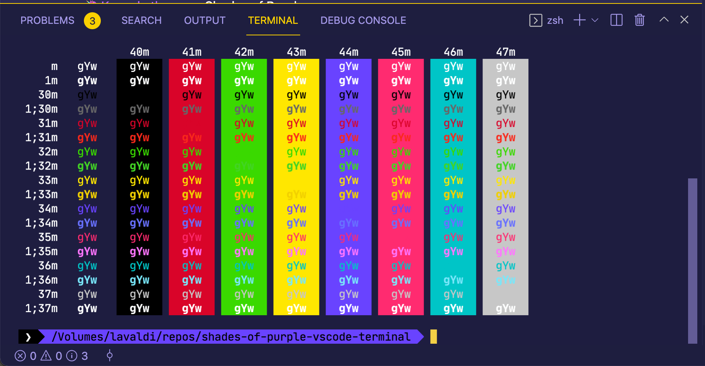

<h1 align="center">Shades of Purple Theme for the VSCode integrated terminal</h1>

> Based on the professional [VS Code theme](https://github.com/ahmadawais/shades-of-purple-vscode) with hand-picked & bold shades of purple 💜 to go along with your integrated terminal. A custom theme with style.

## Install

- Copy the contents of `shades-of-purple.json` into your VS Code settings.json file.

## Put `Shades of Purple` In Other Places

I have built other `Shades of Purple` themes for different software. Here's a list.

- 🦄 [VSCode theme](https://github.com/ahmadawais/shades-of-purple-vscode) — Shades of Purple
- 🦄 [iTerm2 theme](https://github.com/ahmadawais/shades-of-purple-iterm2) — Shades of Purple
- 🦄 [Hyper™ theme](https://github.com/ahmadawais/shades-of-purple-hyper) — Shades of Purple
- 🦄 [Chrome theme](https://chrome.google.com/webstore/detail/ljeonhoonibcofjepiphcekbihoiaife) — Shades of Purple
- 🦄 [HighlightJS theme](https://github.com/ahmadawais/Shades-of-Purple-HighlightJS) — Shades of Purple
- 🦄 [Konsole theme](https://github.com/ahmadawais/shades-of-purple-konsole) — Shades of Purple
- 🦄 [Slack theme](https://github.com/ahmadawais/shades-of-purple-slack) — Shades of Purple
- 🦄 [Alfred theme](https://github.com/ahmadawais/shades-of-purple-alfred) — Shades of Purple
- 🦄 [Cygwin theme](https://github.com/ahmadawais/Shades-of-Purple-Cygwin) — Shades of Purple
- 🦄 [Alacritty theme](https://github.com/ahmadawais/shades-of-purple-alacritty) — Shades of Purple
- 🦄 [WordPress theme](https://ahmadawais.com/shades-of-purple-wordpress/) — Shades of Purple
- 🦄 [Prism JS](https://github.com/FormidableLabs/prism-react-renderer/blob/master/src/themes/shadesOfPurple.js) + [Prism CSS](https://codepen.io/ahmadawais/pen/mgjRRr?editors=0100#0) + [Code-Surfer](https://github.com/pomber/code-surfer#themes) theme — Shades of Purple